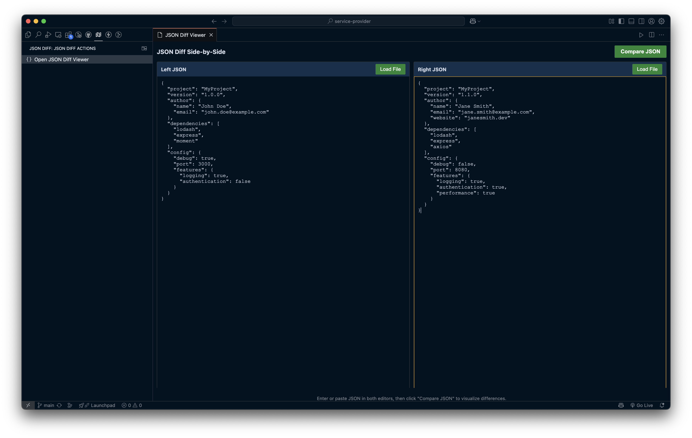
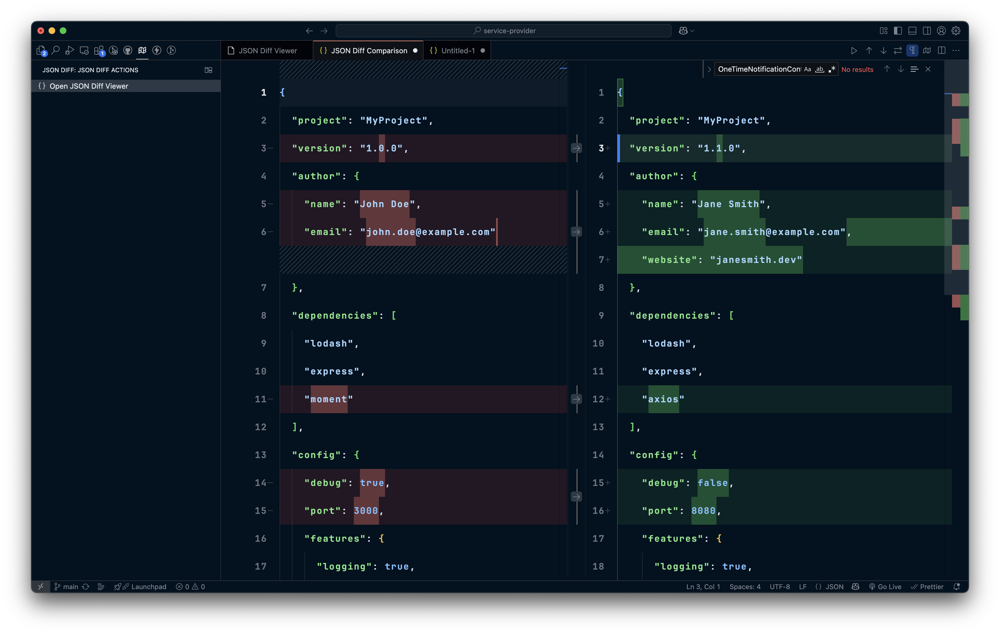

# JSON Diff Side-by-Side

A Visual Studio Code extension that provides a side-by-side view for comparing and visualizing differences between JSON files or text, leveraging VS Code's built-in diffing and JSON formatting capabilities.

## Screenshots

### JSON Diff Selection Interface

### JSON Diff Result Comparison

## Features

- **Side-by-Side JSON Editors**: Two separate editors where you can paste or load JSON content
- **Automatic JSON Formatting**: JSON is automatically formatted when pasted or loaded
- **Visual Diff Comparison**: See differences between JSON structures using VS Code's built-in diff viewer
- **Quick Access**: Icon in the activity bar for easy access to the JSON diff tool
- **File Loading**: Easily load JSON files directly from your filesystem
- **Error Handling**: Helpful error messages for invalid JSON

## How to Use

### Opening the JSON Diff Viewer

There are three ways to access the JSON Diff tool:

1. Click on the JSON Diff icon in the activity bar (left sidebar)
2. Open the Command Palette (`Ctrl+Shift+P` or `Cmd+Shift+P`) and search for "JSON Diff: Open Side-by-Side Diff View"
3. Right-click in any editor and select "JSON Diff: Open Side-by-Side Diff View" from the context menu

### Comparing JSON

1. Open the JSON Diff viewer
2. Paste JSON or load JSON files into the left and right editors
3. Click the "Compare JSON" button to view the differences
4. The JSON is automatically formatted for better readability

### Loading Files

1. Click the "Load File" button in either the left or right editor
2. Select a JSON file from your file system
3. The file content will be loaded and automatically formatted

## Requirements

- Visual Studio Code 1.98.0 or higher

## Extension Settings

This extension doesn't have any specific settings.

## Support the Project

If you find this extension useful, consider supporting its development:

## Known Issues

None at this time.

## Release Notes

### 0.0.2

- Added screenshots to documentation
- Improved error handling and user experience

### 0.0.1

- Initial release of JSON Diff Side-by-Side
- Basic JSON diffing functionality
- Side-by-side editor view
- JSON formatting
- File loading capabilities
- Activity bar integration

---

## Development

### Building the Extension

1. Clone the repository
2. Run `npm install` to install dependencies
3. Run `npm run watch` to start the compiler in watch mode
4. Press F5 to launch the extension in debug mode

### Packaging the Extension

Run `vsce package` to create a VSIX file that can be installed manually.

### Contributing

Contributions are welcome! Please feel free to submit a Pull Request.
